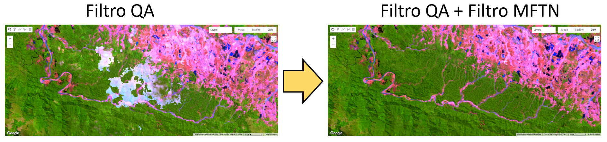

# MFTN Cloud Filtering

Aplicación desarrollada en *Google Earth Engine* para generar compuestos Landsat mediante filtros de calidad, enmascaramiento de nubes y la aplicación de una *Máscara de Filtrado Temporal de Nubes — MFTN*.

La *MFTN* es una adaptación práctica inspirada en el método original *Multi-Temporal Cloud Detection — MTCD, propuesto por **Hagolle et al. (2010)* en el artículo A multi-temporal method for cloud detection, applied to FORMOSAT-2, VENµS, LANDSAT and SENTINEL-2 images.

Esta herramienta permite reducir nubes residuales, bruma y bordes nubosos en imágenes Landsat, mejorando la generación de compuestos multitemporales para análisis de cobertura terrestre, monitoreo ambiental y aplicaciones geoespaciales.

## Descripción

MFTN Cloud Filtering permite procesar imágenes Landsat 5, 7, 8 y 9 usando coordenadas WRS-2 PATH/ROW, un rango temporal definido por el usuario y diferentes opciones de enmascaramiento.

El script incluye filtros para nubes, sombras de nubes, cirrus, nieve/hielo, píxeles sin datos, saturación radiométrica y una máscara temporal simple basada en cambios en la banda azul. También permite aplicar expansión de máscara, corrección BRDF opcional y generar compuestos estadísticos.

## Comparación visual

La siguiente imagen muestra una comparación entre un compuesto generado solo con filtros QA y un compuesto generado aplicando filtros QA junto con la Máscara de Filtrado Temporal de Nubes (MFTN).

## Funcionalidades principales

- Procesamiento de imágenes Landsat Collection 2 Level 2.
- Compatibilidad con Landsat 5, 7, 8 y 9.
- Selección por PATH/ROW.
- Filtros de calidad usando QA_PIXEL y QA_RADSAT.
- Máscara de Filtrado Temporal de Nubes (MFTN simple).
- Expansión de máscara 3x3, 5x5 o 7x7.
- Corrección BRDF opcional.
- Compuestos por mediana, medoide, media, mínimo, máximo, desviación estándar y percentiles.
- Exportación a Google Drive o Google Earth Engine Asset.

## Uso

1. Abrir Google Earth Engine Code Editor.
2. Copiar el contenido del archivo `MFTN_Cloud_Filtering.js`.
3. Pegar el código en un nuevo script.
4. Configurar PATH, ROW, fechas, sensores Landsat y filtros.
5. Presionar `Process & Visualize`.
6. Exportar el resultado a Google Drive o Earth Engine Asset.

## Cómo citar

Si usas este código, aplicación o materiales derivados, por favor cita este repositorio:

Badaracco Meza, R. R., Guerrero Salinas, J. B., & Choccña Rejas, M. A. (2026).  
MFTN Cloud Filtering: Máscara de Filtrado Temporal de Nubes para Google Earth Engine.  
GitHub: https://github.com/geomathcenter/MFTN

## Licencia

Este proyecto se distribuye bajo la licencia MIT. Puedes usar, modificar y compartir el código, manteniendo el aviso de autoría y la licencia correspondiente.
